# Con IceZum Alhambra, la teoría de la Electrónica Digital es más fácil

Para la simulación de los circuitos que traducen a visibles estos resultados, vamos a tomar el siguiente criterio:

-   El **LED 0** de la IceZum Alhambra representará el primer término de cada igualdad.
-   El **LED 7** de la IceZum Alhambra representará el segundo término.

Si ambos ledes se encienden simultáneamente, entenderemos esto como igualdad entre los miembros y, por tanto, que se cumple lo que se indica.

## **Postulados del Álgebra de Boole**

Postulados  | Simulación
--|--
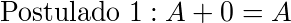  |  [simulación](Postulado1.ice)
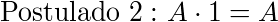  |  [simulación](Postulado2.ice)
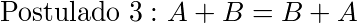  |  [simulación](Postulado3.ice)
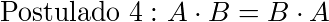  |  [simulación](Postulado4.ice)
  |  [simulación](Postulado5.ice)
  |  [simulación](Postulado6.ice)
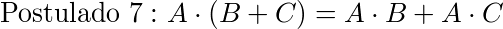  |  [simulación](Postulado7.ice)
  |  [simulación](Postulado8.ice)
  |  [simulación](Postulado9.ice)
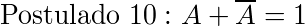  |  [simulación](Postulado10.ice)

## **Teoremas del Álgebra de Boole**

Teoremas  | Simulación
--|--
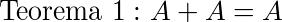  |  [simulación](Teorema1.ice)
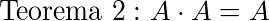  |  [simulación](Teorema2.ice)
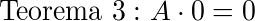  |  [simulación](Teorema3.ice)
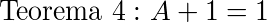  |  [simulación](Teorema4.ice)
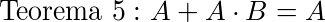  |  [simulación](Teorema5.ice)
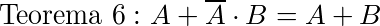  |  [simulación](Teorema6.ice)
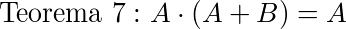  |  [simulación](Teorema7.ice)
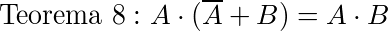  |  [simulación](Teorema8.ice)
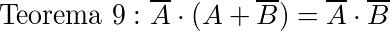  |  [simulación](Teorema9.ice)
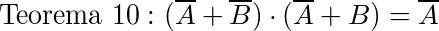  |  [simulación](Teorema10.ice)

## **Leyes de De Morgan**

Ley  | Simulación
--|--
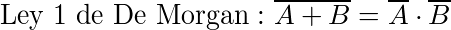  |  [simulación](DeMorgan1.ice)
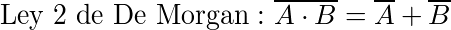  |  [simulación](DeMorgan2.ice)
