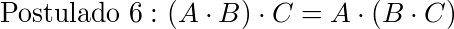
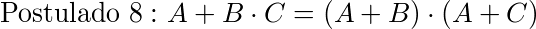
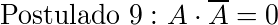

# Con IceZum Alhambra, la teoría es más fácil

Para la simulación de los circuitos que traducen a visibles estos resultados, vamos a tomar el siguiente criterio:

-   El **LED 0** de la IceZum Alhambra representará el primer término de cada igualdad.
-   El **LED 7** de la IceZum Alhambra representará el segundo término.

Si ambos ledes se encienden simultáneamente, entenderemos esto como igualdad entre los miembros y, por tanto, que se cumple lo que se indica.

## **Postulados del Álgebra de Boole**

Postulados  | Simulación  
--|--
  |  [simulación](P1.ice)
  |  [simulación](P2.ice)
  |  [simulación](P3.ice)
  |  [simulación](P4.ice)
  |  [simulación](P5.ice)
  |  [simulación](P6.ice)
  |  [simulación](P7.ice)
  |  [simulación](P8.ice)
  |  [simulación](P9.ice)
  |  [simulación](P10.ice)

## **Teoremas del Álgebra de Boole**

Teoremas  | Simulación
--|--
  |  [simulación](T1.ice)
  |  [simulación](T2.ice)
  |  [simulación](T3.ice)
  |  [simulación](T4.ice)
  |  [simulación](T5.ice)
  |  [simulación](T6.ice)
  |  [simulación](T7.ice)
  |  [simulación](T8.ice)
  |  [simulación](T9.ice)
  |  [simulación](T10.ice)

## **Leyes de De Morgan**

Ley  | Simulación
--|--
  |  [simulación](DM1.ice)
  |  [simulación](DM2.ice)
